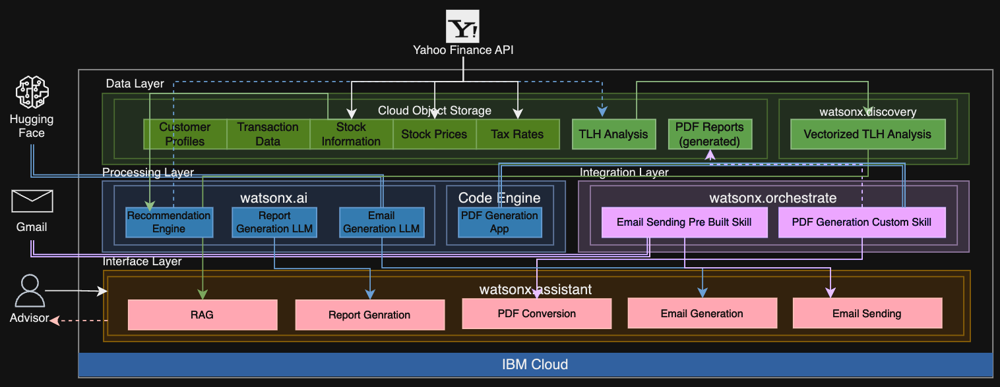

# **AI Financial Advisor Solution**

## **Overview**
The AI Financial Advisor Solution leverages IBM Watsonx capabilities to transform financial advisory workflows, automate tax-loss harvesting, optimize portfolios, and enhance client engagement through advanced AI. This solution integrates IBM's cutting-edge AI technologies with external tools to deliver automation, trust, and measurable value.

---

## **Solution Architecture**
The architecture of the solution follows a modular and scalable design, ensuring seamless data ingestion, processing, and client interaction.

### **Key Layers and Components**

#### **1. Data Layer**  
Stores structured and unstructured financial data for real-time processing and retrieval.
- **Cloud Object Storage**: Manages inputs like customer profiles, stock information, tax rates, and TLH analysis data.
- **External Integrations**:  
   - **Yahoo Finance API**: Fetches real-time stock prices and tax rates.  
   - **Hugging Face**: Integrates AI models for enhanced workflows.

---

#### **2. Processing Layer**  
Core AI-powered engines for generating insights and automating advisory processes.
- **watsonx.ai**:
   - **Recommendation Engine**: Optimizes portfolios and identifies tax-loss harvesting opportunities.
   - **Report Generation LLM**: Generates detailed, client-specific portfolio insights.
   - **Email Generation LLM**: Creates professional, tailored client communications.
- **IBM Code Engine**: Batch processes and generates polished PDF reports.

---

#### **3. Integration Layer**  
Enables orchestration and automation of workflows.
- **watsonx.orchestrate**:
   - **Prebuilt Skills**: Automates email generation and delivery.
   - **Custom Skills**: Handles PDF creation and formatting workflows.

---

#### **4. Interface Layer**  
Delivers AI-driven interactions to advisors through conversational tools.
- **watsonx.assistant**:
   - **RAG (Retrieval-Augmented Generation)**: Provides real-time, actionable insights.
   - **Report Generation and PDF Conversion**: Automates report creation and sharing.
   - **Email Generation and Sending**: Ensures seamless client communication.

---

## **Key Features**
- **Advanced Portfolio Optimization**:  
   Identifies unrealized tax-saving opportunities and ensures compliance with IRS wash-sale rules.

- **AI-Driven Report Generation**:  
   Automates personalized portfolio reports with actionable insights, formatted as professional-grade PDFs.

- **Automated Email Communication**:  
   Drafts tailored, professional client communications, enhancing engagement.

- **Interactive Decision Support**:  
   Enables advisors to interact with AI for real-time portfolio insights and compliance checks.

# More details to come soon
